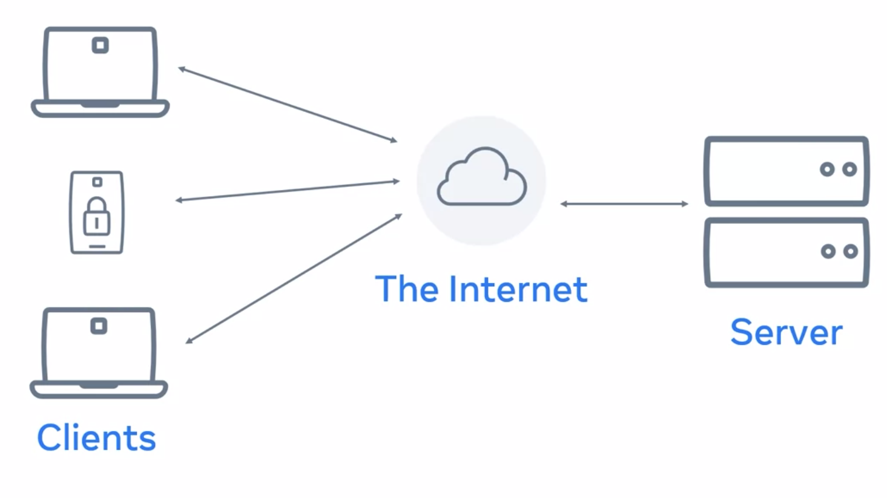
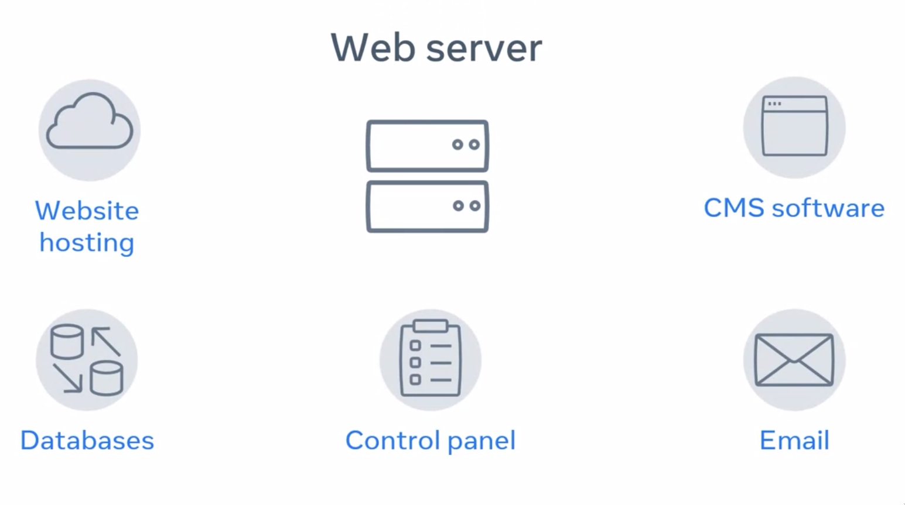
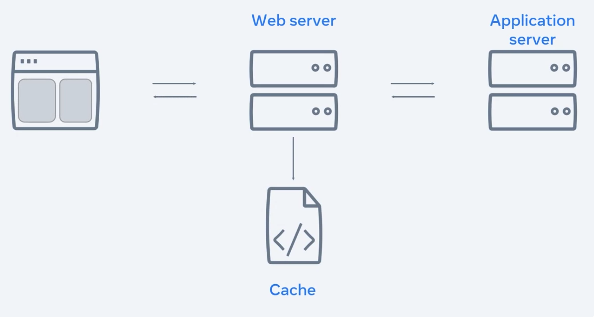

# Table of Contents

1.  [Schedule](#org924e558)
2.  [Introduction to Back-end Development](#org76eaf6d)
    1.  [Week 1](#org666f273)
        1.  [Capstone project overview](#org95f597b)
        2.  [How the web works](#org53682f1)
        3.  [Grace Egbo - a day in the life of a backend dev.](#org3e4df8e)
        4.  [How the internet works](#orgb0b3740)
        5.  [Servers](#org6ad14a5)
        6.  [What are websites and webpages?](#org1c1cc02)
        7.  [TCP - Transmission Control Protocol](#org829557e)
        8.  [UDP - User Datagram Protocol](#org98221a5)
        9.  [HTTP - HyperText Transfer Protocol](#orgf40ef67)
        10. [Makeup of a HTTP request](#orga8c6ca7)
        11. [Makeup of a HTTP response](#orgaa4dfea)
        12. [Examples about HTTP](#org2100b72)
        13. [IDEs](#orgb6a1fc2)
        14. [Extra resources](#org4945bb2)
    2.  [Week 2](#orga258c78)
        1.  [HTML](#org14cca89)
        2.  [DOM](#org07ccffd)
        3.  [CSS](#org7e615b9)
        4.  [Extra Resources](#org0bd1139)
    3.  [Week 3](#org701efa1)
        1.  [Working with libraries](#org557f674)
        2.  [Responsive Design](#org242c506)
        3.  [Types of Grids](#org29b29f4)
        4.  [Bootstrap](#orgc124153)
        5.  [Static vs Dinamic websites](#orgff52fa4)
        6.  [SPA and Multi-Page Application](#org7a4b6fd)
        7.  [**React**](#orgb9bb416)
        8.  [Extra resources](#orgf0ce11c)
3.  [Programming in Phyton](#org4d85277)
    1.  [Objectives](#org1dee631)
    2.  [Week1-Notes - Introduction to Python](#org80760c5)
        1.  [Course content](#orgc240aca)
        2.  [Input](#orgffac01c)
        3.  [Format](#org5c72f09)
        4.  [Match](#org43ed2aa)
    3.  [Week2-Notes - Python Data structures](#orge41dd98)
        1.  [\*args, \*\*kwargs](#org5317099)
        2.  [Additional Resources](#org5369b91)
        3.  [Open, close files](#orgc337ef5)
        4.  [Read files](#orgf60533c)
        5.  [Extra Resources](#org91a80ad)
    4.  [Week3-Notes - Procedural Programming](#orgcc6894a)
        1.  [What is procedural programming?](#orgd859845)

Back-end development by [Meta, on Coursera](https://www.coursera.org/professional-certificates/meta-back-end-developer).

# Schedule

<table border="2" cellspacing="0" cellpadding="6" rules="groups" frame="hsides">

<colgroup>
<col  class="org-left" />

<col  class="org-left" />

<col  class="org-left" />

<col  class="org-left" />

<col  class="org-left" />

<col  class="org-left" />

<col  class="org-left" />
</colgroup>
<thead>
<tr>
<th scope="col" class="org-left">Monday</th>
<th scope="col" class="org-left">Tuesday</th>
<th scope="col" class="org-left">Wednesday</th>
<th scope="col" class="org-left">Thursday</th>
<th scope="col" class="org-left">Friday</th>
<th scope="col" class="org-left">Saturday</th>
<th scope="col" class="org-left">Sunday</th>
</tr>
</thead>

<tbody>
<tr>
<td class="org-left">8h-8h45m</td>
<td class="org-left">x</td>
<td class="org-left">x</td>
<td class="org-left">&#xa0;</td>
<td class="org-left">&#xa0;</td>
<td class="org-left">x</td>
<td class="org-left">&#xa0;</td>
</tr>

<tr>
<td class="org-left">9h-9h45m</td>
<td class="org-left">x</td>
<td class="org-left">x</td>
<td class="org-left">&#xa0;</td>
<td class="org-left">&#xa0;</td>
<td class="org-left">x</td>
<td class="org-left">&#xa0;</td>
</tr>

<tr>
<td class="org-left">10h-10h45m</td>
<td class="org-left">x</td>
<td class="org-left">&#xa0;</td>
<td class="org-left">&#xa0;</td>
<td class="org-left">&#xa0;</td>
<td class="org-left">x</td>
<td class="org-left">&#xa0;</td>
</tr>
</tbody>

<tbody>
<tr>
<td class="org-left">13h-13h45m</td>
<td class="org-left">x</td>
<td class="org-left">x</td>
<td class="org-left">x</td>
<td class="org-left">x</td>
<td class="org-left">&#xa0;</td>
<td class="org-left">x</td>
</tr>

<tr>
<td class="org-left">14h-14h45m</td>
<td class="org-left">x</td>
<td class="org-left">x</td>
<td class="org-left">x</td>
<td class="org-left">x</td>
<td class="org-left">&#xa0;</td>
<td class="org-left">x</td>
</tr>

<tr>
<td class="org-left">15h-15h45m</td>
<td class="org-left">&#xa0;</td>
<td class="org-left">&#xa0;</td>
<td class="org-left">x</td>
<td class="org-left">x</td>
<td class="org-left">&#xa0;</td>
<td class="org-left">x</td>
</tr>
</tbody>

<tbody>
<tr>
<td class="org-left">17h30m-18h15m</td>
<td class="org-left">&#xa0;</td>
<td class="org-left">&#xa0;</td>
<td class="org-left">x</td>
<td class="org-left">x</td>
<td class="org-left">&#xa0;</td>
<td class="org-left">&#xa0;</td>
</tr>

<tr>
<td class="org-left">18h30m-19h15m</td>
<td class="org-left">x</td>
<td class="org-left">x</td>
<td class="org-left">x</td>
<td class="org-left">x</td>
<td class="org-left">&#xa0;</td>
<td class="org-left">&#xa0;</td>
</tr>

<tr>
<td class="org-left">19h30m-20h15m</td>
<td class="org-left">x</td>
<td class="org-left">x</td>
<td class="org-left">x</td>
<td class="org-left">x</td>
<td class="org-left">&#xa0;</td>
<td class="org-left">&#xa0;</td>
</tr>
</tbody>
</table>

# Introduction to Back-end Development

## Week 1

### Capstone project overview

1.  TODO Create Django web server, with multilple API endpoints.

2.  TODO Connect it to a MySQL database.

3.  TODO Create a templace system driven by Django views.

### How the web works

1.  Fullstack

    Both front and back development. Mostly, on connecting the two.

    - Planning.
    - Architecture.
    - Design.
    - Development.
    - Deployment.
    - Maintenance.

2.  Front-end

    Design patterns of elements on a page.

3.  Back-end

    - Back-end language.
    - Database.
    - APIs.
    - Web servers

### Grace Egbo - a day in the life of a backend dev.

The day breaks out in sections.

1.  Code review

2.  Possible quick fixes

3.  Meeting about ideias and needs

4.  Coding

5.  Soft skills/People skills

    - Communicate.
    - Listen to perspectives.
    - Remote world makes that even more necessary.

### How the internet works

1.  Definition: `Network`

    Two or more computers connected through wired or wireless connection.

    1.  Multiples devices in a network - Network Switches

        - Complexity is brough down by using `Network switches`.

2.  Definition: `Interconnected network`

    When multiple `Networks` connect through `Netowork Switches`.
    E.g., the `Internet`.

    

### Servers

- Data centers: multitude of servers on a physical space.
- `Server purpose` _data center_ will have different machinery, depending on the application objetive.

1.  Webservers

    - Website hosting.
    - Database.
    - Control panel.
    - CMS software.
    - Email.

    

    1.  Web request

        `Request-response cycle`:

        > It&rsquo;s the job of the web server to send you back those website content, upon requesting, by typing the URL of the website.

        Designed to respond to thousands of requests of clients per second.

### What are websites and webpages?

1.  Webpage

    Display content, like text, images, videos etc, on the web browser.

2.  Website

    It&rsquo;s a collection of web pages linked together.

3.  HTML, CSS and JavaScript

    1.  HTML

        `Hyperlink Text Markup Language`
        Tells how to structure elements in a page.

    2.  CSS

        Cascade Styling Sheets.

    3.  JavaScript

        Programming language build into the browser.
        Tools for `interactivity`, `data-processing` and `control-and-action`.

    4.  Page rendering process

        > While interpreting each line of HTML, the browser creates a building-block that
        > switches the visual representation you see on screen.

        A response from the webserver must be a complete web page, in other to fulfill
        the request, to show the page, in the browser.

    5.  Web browsers

        Software application used to browse the world-wide-web.

        It works by sending a request to a web server, and then receives a response
        containing the content to be displayed on your device.

        1.  URL

            `Uniform Resource Locator`, contains the protocol (HTTP/HTTPS), the domain name,
            and the file-path.

        2.  HTTP

            - HyperText Transfer Protocol.
            - Request-response cycle.

### TCP - Transmission Control Protocol

- Transmits messages with high precision.
- Barley no data loss.
- Almost always on the right addresses.
- Slower than UDP.

### UDP - User Datagram Protocol

- Corrupt package issue solved (barely no data loss).
- Easily out of order data-packages.
- Possibly a lot of loss of information.

### HTTP - HyperText Transfer Protocol

- Standard for the web communication.
- Transfers data:
  - Web pages,
  - Images,
  - Files.
- Request-response based communication between client and server.

### Makeup of a HTTP request

It must contain a

- Method,
- Path,
- Version,
- Headers.

1.  Method

    > Describes the kind of action that the client wants to perform.

    Most common are:

    - GET;
    - POST;
    - PUT;
    - DELETE;

    1.  Get

        Retrieves information.

    2.  Post

        Sends information.

    3.  Put

        Update data on webserver. That is, data1 is swapped for data2.

    4.  Delete

        Removes the resource.

2.  Path

    > The path is a representation of where the resource is located on the webserver.

3.  Version

    > Rules of what constitutes and how request and response happen.

4.  Headers

    > Headers contains additional information about the request and the client that is making the request.

### Makeup of a HTTP response

It&rsquo;s similar to HTTP requests.

After the `header`, the `message body` contains data that is the response:

- Text.
- HTML Markup.
- Images.
- Files.
- etc.

1.  Header

    - HTTP response status (200, 404, 400, etc.).
    - Status message (OK, Not Found, Server Not Responding, etc.).

    1.  Informational

        Responses ranging 100-199.

        - Provisional.
        - Interim response.
        - Most common: 100 CONTINUE.

    2.  Successful

        Responses ranging 200-299.

        If successfully processed (200 OK),

        - GET: Found/included.
        - POST: Successfully transmitted.
        - PUT: Successfully transmitted.
        - DELETE: Deleted.

    3.  Redirection

        Responses ranging 300-399.

        - 301 MOVED PERMANENTLY.
        - 302 FOUND.

    4.  Client error

        Responses ranging 400-499.

        - 400 BAD DATA (transmitted to the server);
        - 401 MUST LOGIN (before making the request);
        - 403 REFUSE TO PROCESS (but valid request);
        - 404 NOT FOUND (requested data);

    5.  Server error

        Responses ranging 500-599.

        - 500 INTERNAL SERVER ERROR (server failed to process request);

### Examples about HTTP

1.  **Request Line**

    > Every HTTP request begins with the request line.
    >
    > This consists of the HTTP method, the requested resource and the HTTP protocol
    > version.
    >
    > `GET /home.html HTTP/1.1`
    >
    > In this example, `GET` is the HTTP method, `/home.html` is the resource
    > requested and HTTP 1.1 is the protocol used.

2.  HTTP Method

### IDEs

`Integrated Development Environment` offers:

- Syntax highlight;
- Keyword documentation;
- Auto-complete suggestions;
- Navigation ease;
- Unified Environment for development;

### Extra resources

HTTP Overview (Mozilla)

<https://developer.mozilla.org/en-US/docs/Web/HTTP/Overview>

Introduction to Networking by Dr.Charles R Severance

<https://www.amazon.com/Introduction-Networking-How-Internet-Works/dp/1511654945/>

Chrome Developer Tools Overview (Google)

<https://developer.chrome.com/docs/devtools/overview/>

Firefox Developer Tools User Docs (Mozilla)

<https://firefox-source-docs.mozilla.org/devtools-user/index.html>

Getting Started with Visual Studio Code (Microsoft)

<https://code.visualstudio.com/docs>

## Week 2

### HTML

1.  Table

2.  Forms

3.  Input tags

    - Text;
    - Password;
    - Checkbox;
    - Radio;
    - Textarea;
    - Select;

### DOM

`Document Object Model`
Server -> Web browser receives webpage -> Transforms in a DOM scheme.

### CSS

How to display HTML elements.

- Selector (which element to act upon);
- Key-values:
  - Property;
  - Property-value;

### Extra Resources

1.  HTML and DOM

    Learn more​
    Here is a list of resources that may be helpful as you continue your learning journey.

    HTML Elements Reference (Mozilla)

    <https://developer.mozilla.org/en-US/docs/Web/HTML/Element>

    The Form Element (Mozilla)

    <https://developer.mozilla.org/en-US/docs/Web/HTML/Element/form>

    What is the Document Object Model? (W3C)

    <https://www.w3.org/TR/WD-DOM/introduction.html>

    ARIA in HTML (W3C via Github)

    <https://w3c.github.io/html-aria/>

    ARIA Authoring Practices (W3C)

    <https://www.w3.org/TR/wai-aria-practices-1.2/>

## Week 3

### Working with libraries

Libraries can depend on other libraries forming a tree of dependencies.

- Bundlers unify all code in one file, or few of them.
- Finally, add the final bundled file into your HTML.

### Responsive Design

A `responsive grid` happens when we combine:

- Flexible grids;
- Fluid images;
- Media queries.

1.  Flexible grids

    - Gutter: space between contents;
    - Margin: space between content and screen;
    - Sizes based on percentages.

2.  Fluid images

    - Max-width: 100%;
      - Shrink based on container-element size;
    - Fit on page;
    - Never grow larger than original size.

3.  Media queries

    Controls:

    - Display size;
    - Orientation;
    - Aspect ratio.

### Types of Grids

- Fixed grid;
- Fluid grid;
- Hybrid grid;

1.  Fixed Grid

    - Fixed width-columns;
    - Flexible-margins;

2.  Fluid grid

    - Fluid width-columns;
    - Fixed-gutters;
    - Fixed-margins;

    Columns either grow or shrink to adapt to the available space.

3.  Hybrid grid

    - Fluid and fixed width components;
    - Different rules, depending on device;
    - Optimize experience.

### Bootstrap

1.  Responsive design with class infix

    Convention for `class infix` made for `responsive design`, by **Bootstrap**.

    

2.  Class modifiers

    It&rsquo;s like the conjugation of verbs, so you have different meaning, with the same functionality. E.i., buttons of alert that can mean &ldquo;just pay attention&rdquo;, or &ldquo;**DANGER!**&rdquo; etc.

### Static vs Dinamic websites

1.  Static part of a website

    - Images;
    - Videos;
    - Text.

2.  Dinamic part of a website

    Static content that is generated, depending on the response of an `application server`.

    To speed up the process and don&rsquo;t overload the website, `cache` is used to store dynamically generated content.

    

### SPA and Multi-Page Application

1.  Multi-page Application

    - Loads all content at each update
    - Application server return the entire webpage

2.  SPA

    SPA can use both `bundling` and `lazy-load` to display dynamic content.

    1.  Bundling

        When a new component or data is requested the hole section is returned and rendered.

    2.  Lazy-loading

        When a new piece of a component or data is requested, only the fraction of data and component concerned for the request is loaded.

### **React**

### Extra resources

1.  Bootstrap

    Bootstrap Official Website

    <https://getbootstrap.com/>

    Bootstrap 5 Foundations by Daniel Foreman

    <https://www.amazon.com/Bootstrap-Foundations-Mr-Daniel-Foreman/dp/B0948GRS8W/>

    Responsive Web Design with HTML5 and CSS by Ben Frain

    <https://www.amazon.com/Responsive-Web-Design-HTML5-CSS/dp/1839211563/>

    Bootstrap Themes

    <https://themes.getbootstrap.com/>

2.  React

    Learn more​
    Here is a list of resources that may be helpful as you continue your learning journey.

    React Official Website
    <https://reactjs.org/>

    Choosing between Traditional Web Apps and Single Page Apps (Microsoft)

    <https://docs.microsoft.com/en-us/dotnet/architecture/modern-web-apps-azure/choose-between-traditional-web-and-single-page-apps>

    React Source Code (Github)

    <https://github.com/facebook/react>

    Introduction to React.js

    The original video recorded at Facebook in 2013.

    <https://youtu.be/XxVg_s8xAms>

# Programming in Phyton

## Objectives

Get started with the Python programming language and associated foundational concepts.

**Learning Objectives:**

- Recognize common applications of the Python programming language.
- Explain foundational software engineering concepts.
- Use operators to program a simple output in Python.
- Use control flow and loops to solve a problem

## Week1-Notes - Introduction to Python

### Course content

> Course content  
> During this course, you’ll cover everything you need to begin with Python development. The content of the four modules is listed below.
>
> **Module 1 - Getting started with Python**
> In this module, you will get an introduction to the course and you’ll cover a brief summary of the history of programming. You will also learn the basics of how programming works and discover typical uses for Python in real-life. There are also some tips on how to take this course successfully.
>
> Before embarking on any coding you’ll first establish if your current computer system is set up correctly and identify any required operating system dependencies. Then you’ll explore different ways that you can run programs through Python.
>
> Next, you’ll study Python syntax using comments, variables, data types and user input and output. You’ll proceed to expand your Python skills by using math and logical operators so you can control the flow of your code and perform operations such as addition, subtraction, division, and multiplication.
>
> Python has multiple ways to do code loops or looping. You will examine looping constructs to iterate your code over multiple sequences.
>
> **Module 2 - Basic programming with Python**
> In module 2, you&rsquo;ll receive an introduction to Python functions, including how to declare a function, and how to pass data to a function or return data from a function. You will also explore data structures, scope, and the concepts of lists and how they can be used in Python. You will also discover tuples, sets, dictionaries and kwargs, gaining an understanding of how their main uses.
>
> Errors and exceptions are two very important aspects of learning Python as a new developer. In module 2, you will start with errors and exceptions, and explore what happens when something goes wrong with your code. Exception handling and Python file handling are covered, as are how to create files in Python and various methods of inserting content into a new file.
>
> **Module 3 - Programming paradigms**
> In the third module, you will cover programming paradigms, and look at the features and concepts behind procedural programming, functional programming and object oriented programming.
>
> A key feature of procedural programming is algorithms, you will explore how they can be used to solve problems, how algorithmic complexity is calculated and learn about Big-O notation.
>
> Next you will learn about pure functions and recursion in functional programming, as well as the difference between maps and filters.
>
> Finally, you will explore object-oriented programming and its four main concepts. ​ You will explore the relationship between classes and instances in Python by creating classes, instantiating them, and accessing their variables and methods. You’ll learn about abstract classes and methods and how to implement them. The rules of method resolution and inheritance with child and parent classes are also explained. Being able to read files is essential when working with stored data in Python and you’ll discover several built-in functions to make this easier.
>
> **Module 4 - Modules, packages, libraries and tools**
> In module 4, you learned that Python is a powerful language that allows you to build amazing things. But it can gain even more functionality with the use of modules, libraries and tools. You will learn about Modules and that they are the building blocks for adding functionality to your code, so you don’t need to continually redo everything.
>
> You will also explore some of the commonly used Python libraries in data analysis and data science, and how they can apply to the areas of machine learning and artificial intelligence.
>
> Finally, you’ll find out why testing is an essential component of Quality Assurance and explore the type of testing you should use. You will learn about test automation packages and the importance of automated testing and you’ll write some tests using PyTest. Finally, you will explore the evolution of Test-driven development (or TDD), and focus on how to apply a test-driven development methodology.
>
> **Module 5 - Graded assessment**
> Here you&rsquo;ll learn about the graded assessment. After you complete the individual items in this module, you&rsquo;ll test your knowledge and skills by completing an end of course graded assessment.

### Input

    ipt = input("Please input something")
    print(inp)

### Format

    a=1
    b="abb"
    print("{0} is different from {1}" .format(a, b))

### Match

    http = 200
    match http:
        case 200:
            print("ok!")
        _:
            print("anything else!")

    a = isinstance(str, "aa")

    print(a)

## Week2-Notes - Python Data structures

### \*args, \*\*kwargs

1.  Args

        def s(*args):
            return sum(args)

        print(s(3,4,5,6))

        def s(*args):
            return sum(*args)

        print(s([3,4,5,6]))

2.  Kwargs

        def s(**kwargs):
            return sum()

        print(s(3,4,5,6))

### Additional Resources

1.  First

    Python allows you to do quite a lot with very little code. Compared to other languages such as Java or C#, Python has a much easier learning curve. It lends itself well to the &ldquo;write less, do more philosophy&rdquo;. Python developers are also in high demand and learning how to program in Python makes for a good career choice.

    You can access the links below to learn more about programming in Python.

    Check out the Python website to find out more about built-in functions:
    Python

    Check out W3 Schools to learn more about coding and web development:
    W3Schools

    Check out HackerRank to practice your new acquired Python skills:
    HackerRank

2.  Data Structures

    Here is a list of resources that may be helpful as you continue your learning journey.

    Learn more about Python data structures (Python documentation) on the Python website:
    Python.org - Data structures

    Explore common Python data structures at the Real Python website:
    Real Python - Data structures

### Open, close files

1.  Open files

    1.  options

        - `r`: read (text)
        - `rb`: read (binary)
        - `r+`: read and write
        - `w`: write (overwrite file)
        - `a`: append data

    2.  `with open`

        No need to use the `close` function.

            with open('testing.txt', 'r') as file:

2.  Close files

    - No arguments.

3.  Examples

    1.  Open and read

            file = open('test.txt', mode='r')

            data = file.readline()

            print(data)

            file.close()

            # alternative
            with open('test.txt', mode='r') as file:
                data = file.readline()
                print(data)

            Hello there!

    2.  Create file and populate it

            try:
                with open('sample/newfile.txt', 'w') as file:
                    file.writelines(["Hello", "\nThere", "\nThird line!"])

                with open('sample/newfile.txt', 'a') as file:
                    file.writelines(["\nHello", "\nThere", "\nThird line!"])
            except FileNotFoundError as e:
                print("Error: ", e)

### Read files

1.  Complete file

        with open('samplefile.txt', 'r') as file:
            print(file.read())

2.  Only selected characters

        with open('samplefile.txt', 'r') as file:
            print(file.read(40))

3.  Read a line

    Reads the entire line:

        with open('samplefile.txt', 'r') as file:
            print(file.readline())

    Reads the line until the _nth_ character:

        n=10
        with open('samplefile.txt', 'r') as file:
            print(file.readline(n))

4.  Read multiple lines

    `readlines()` read the entire contents of the file and returns it in an ordered list,

        with open('samplefile.txt', 'r') as file:
            lines=file.readlines()
            print(len(lines))

            for line in lines:
                print(line)

5.  Looping through lines

    `with open() as file` already returns a list of lines stored in `file`.

        with open('samplefile.txt', 'r') as file:
            for line in file:
                print(line)

### Extra Resources

The following resources will be helpful as additional references in dealing with different concepts related to the topics you have covered in this module.

Learn more about exceptions and errors in Python on the Python website:
Exceptions and Errors in Python - Python docs

Check out the PyNative website to learn more about file handling in Python:
File handling in Python

## Week3-Notes - Procedural Programming

Principle `DRY`:

- Don&rsquo;t;
- Repeat;
- Yourself.

### What is procedural programming?

Creating reusable code that is used multiple times, so to DRY.
