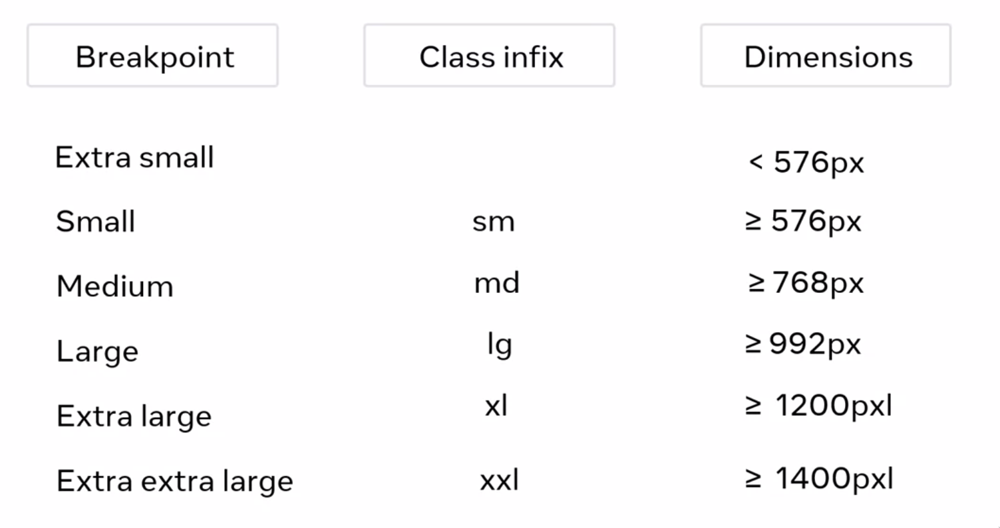

# Table of Contents

1.  [Schedule](#org93adff8)
2.  [Week 1](#org8d2f8f8)
    1.  [Capstone project overview](#org627dbce)
        1.  [Create Django web server, with multilple API endpoints.](#org6c6a733)
        2.  [Connect it to a MySQL database.](#org3cc51e2)
        3.  [Create a templace system driven by Django views.](#org1aec221)
    2.  [How the web works](#org685f97c)
        1.  [Fullstack](#org737c599)
        2.  [Front-end](#org4e71ed9)
        3.  [Back-end](#orga8231a4)
    3.  [Grace Egbo - a day in the life of a backend dev.](#org32cb198)
        1.  [Code review](#org946c47a)
        2.  [Possible quick fixes](#orgcb549a1)
        3.  [Meeting about ideias and needs](#org26383e7)
        4.  [Coding](#orgfe83181)
        5.  [Soft skills/People skills](#orgd91cb06)
    4.  [How the internet works](#orgeec2d1e)
        1.  [Definition: `Network`](#orgcb17c03)
        2.  [Definition: `Interconnected network`](#org9ab04d1)
    5.  [Servers](#orge33fb8e)
        1.  [Webservers](#org98f6807)
    6.  [What are websites and webpages?](#orgf5cedaa)
        1.  [Webpage](#org0e12c13)
        2.  [Website](#orge2929d9)
        3.  [HTML, CSS and JavaScript](#orgc8af6e2)
    7.  [TCP - Transmission Control Protocol](#org7b5f06d)
    8.  [UDP - User Datagram Protocol](#orga4f06eb)
    9.  [HTTP - HyperText Transfer Protocol](#org3d7c40d)
    10. [Makeup of a HTTP request](#orga3bab9a)
        1.  [Method](#orgba2cc2e)
        2.  [Path](#orgaf81edf)
        3.  [Version](#orga8af3dd)
        4.  [Headers](#orgce7f953)
    11. [Makeup of a HTTP response](#org8301a89)
        1.  [Header](#org52f0825)
    12. [Examples about HTTP](#org474c2db)
        1.  [**Request Line**](#orgc6343c7)
        2.  [HTTP Method](#org011a85e)
    13. [IDEs](#orgb6c6518)
    14. [Extra resources](#org5fff99f)
3.  [Week 2](#orgf6464f6)
    1.  [HTML](#orga3b5ce3)
        1.  [Table](#org153d20a)
        2.  [Forms](#org29a31a0)
        3.  [Input tags](#orgae92c8b)
    2.  [DOM](#org9c135b5)
    3.  [CSS](#org61d3288)
    4.  [Extra Resources](#org70c3961)
        1.  [HTML and DOM](#org4db6831)
4.  [Week 3](#orgb2f300d)
    1.  [Working with libraries](#org0e639bc)
    2.  [Responsive Design](#org01885f9)
        1.  [Flexible grids](#orge6c744c)
        2.  [Fluid images](#org0f9706c)
        3.  [Media queries](#org12903f8)
    3.  [Types of Grids](#org5bafec4)
        1.  [Fixed Grid](#orgaed5997)
        2.  [Fluid grid](#org323e8b6)
        3.  [Hybrid grid](#orga16349c)
    4.  [Bootstrap](#orgece7f76)
        1.  [Responsive design with class infix](#org1c546f5)
        2.  [Class modifiers](#orgbac1f7b)
    5.  [Extra resources](#org0c99473)
        1.  [Bootstrap](#org56d0e0a)

Back-end development by [Meta, on Coursera](https://www.coursera.org/professional-certificates/meta-back-end-developer).

# Schedule

<table border="2" cellspacing="0" cellpadding="6" rules="groups" frame="hsides">

<colgroup>
<col  class="org-left" />

<col  class="org-left" />

<col  class="org-left" />

<col  class="org-left" />

<col  class="org-left" />

<col  class="org-left" />

<col  class="org-left" />
</colgroup>
<thead>
<tr>
<th scope="col" class="org-left">Monday</th>
<th scope="col" class="org-left">Tuesday</th>
<th scope="col" class="org-left">Wednesday</th>
<th scope="col" class="org-left">Thursday</th>
<th scope="col" class="org-left">Friday</th>
<th scope="col" class="org-left">Saturday</th>
<th scope="col" class="org-left">Sunday</th>
</tr>
</thead>

<tbody>
<tr>
<td class="org-left">8h-8h45m</td>
<td class="org-left">x</td>
<td class="org-left">x</td>
<td class="org-left">&#xa0;</td>
<td class="org-left">&#xa0;</td>
<td class="org-left">x</td>
<td class="org-left">&#xa0;</td>
</tr>

<tr>
<td class="org-left">9h-9h45m</td>
<td class="org-left">x</td>
<td class="org-left">x</td>
<td class="org-left">&#xa0;</td>
<td class="org-left">&#xa0;</td>
<td class="org-left">x</td>
<td class="org-left">&#xa0;</td>
</tr>

<tr>
<td class="org-left">10h-10h45m</td>
<td class="org-left">x</td>
<td class="org-left">&#xa0;</td>
<td class="org-left">&#xa0;</td>
<td class="org-left">&#xa0;</td>
<td class="org-left">x</td>
<td class="org-left">&#xa0;</td>
</tr>
</tbody>

<tbody>
<tr>
<td class="org-left">13h-13h45m</td>
<td class="org-left">x</td>
<td class="org-left">x</td>
<td class="org-left">x</td>
<td class="org-left">x</td>
<td class="org-left">&#xa0;</td>
<td class="org-left">x</td>
</tr>

<tr>
<td class="org-left">14h-14h45m</td>
<td class="org-left">x</td>
<td class="org-left">x</td>
<td class="org-left">x</td>
<td class="org-left">x</td>
<td class="org-left">&#xa0;</td>
<td class="org-left">x</td>
</tr>

<tr>
<td class="org-left">15h-15h45m</td>
<td class="org-left">&#xa0;</td>
<td class="org-left">&#xa0;</td>
<td class="org-left">x</td>
<td class="org-left">x</td>
<td class="org-left">&#xa0;</td>
<td class="org-left">x</td>
</tr>
</tbody>

<tbody>
<tr>
<td class="org-left">17h30m-18h15m</td>
<td class="org-left">&#xa0;</td>
<td class="org-left">&#xa0;</td>
<td class="org-left">x</td>
<td class="org-left">x</td>
<td class="org-left">&#xa0;</td>
<td class="org-left">&#xa0;</td>
</tr>

<tr>
<td class="org-left">18h30m-19h15m</td>
<td class="org-left">x</td>
<td class="org-left">x</td>
<td class="org-left">x</td>
<td class="org-left">x</td>
<td class="org-left">&#xa0;</td>
<td class="org-left">&#xa0;</td>
</tr>

<tr>
<td class="org-left">19h30m-20h15m</td>
<td class="org-left">x</td>
<td class="org-left">x</td>
<td class="org-left">x</td>
<td class="org-left">x</td>
<td class="org-left">&#xa0;</td>
<td class="org-left">&#xa0;</td>
</tr>
</tbody>
</table>

# Week 1

## Capstone project overview

### TODO Create Django web server, with multilple API endpoints.

### TODO Connect it to a MySQL database.

### TODO Create a templace system driven by Django views.

## How the web works

### Fullstack

Both front and back development. Mostly, on connecting the two.

-   Planning.
-   Architecture.
-   Design.
-   Development.
-   Deployment.
-   Maintenance.

### Front-end

Design patterns of elements on a page.

### Back-end

-   Back-end language.
-   Database.
-   APIs.
-   Web servers

## Grace Egbo - a day in the life of a backend dev.

The day breaks out in sections.

### Code review

### Possible quick fixes

### Meeting about ideias and needs

### Coding

### Soft skills/People skills

-   Communicate.
-   Listen to perspectives.
-   Remote world makes that even more necessary.

## How the internet works

### Definition: `Network`

Two or more computers connected through wired or wireless connection.

1.  Multiples devices in a network - Network Switches

    -   Complexity is brough down by using `Network switches`.

### Definition: `Interconnected network`

When multiple `Networks` connect through `Netowork Switches`.
E.g., the `Internet`.

## Servers

-   Data centers: multitude of servers on a physical space.
-   `Server purpose` *data center* will have different machinery, depending on the application objetive.

### Webservers

-   Website hosting.
-   Database.
-   Control panel.
-   CMS software.
-   Email.

1.  Web request

    `Request-response cycle`:
    
    > It&rsquo;s the job of the web server to send you back those website content, upon requesting, by typing the URL of the website.
    
    Designed to respond to thousands of requests of clients per second.

## What are websites and webpages?

### Webpage

Display content, like text, images, videos etc, on the web browser.

### Website

It&rsquo;s a collection of web pages linked together.

### HTML, CSS and JavaScript

1.  HTML

    `Hyperlink Text Markup Language`
    Tells how to structure elements in a page.

2.  CSS

    Cascade Styling Sheets.

3.  JavaScript

    Programming language build into the browser.
    Tools for `interactivity`, `data-processing` and `control-and-action`.

4.  Page rendering process

    > While interpreting each line of HTML, the browser creates a building-block that
    > switches the visual representation you see on screen.
    
    A response from the webserver must be a complete web page, in other to fulfill
    the request, to show the page, in the browser.

5.  Web browsers

    Software application used to browse the world-wide-web.
    
    It works by sending a request to a web server, and then receives a response
    containing the content to be displayed on your device.
    
    1.  URL
    
        `Uniform Resource Locator`, contains the protocol (HTTP/HTTPS), the domain name,
        and the file-path.
    
    2.  HTTP
    
        -   HyperText Transfer Protocol.
        -   Request-response cycle.

## TCP - Transmission Control Protocol

-   Transmits messages with high precision.
-   Barley no data loss.
-   Almost always on the right addresses.
-   Slower than UDP.

## UDP - User Datagram Protocol

-   Corrupt package issue solved (barely no data loss).
-   Easily out of order data-packages.
-   Possibly a lot of loss of information.

## HTTP - HyperText Transfer Protocol

-   Standard for the web communication.
-   Transfers data:
    -   Web pages,
    -   Images,
    -   Files.
-   Request-response based communication between client and server.

## Makeup of a HTTP request

It must contain a

-   Method,
-   Path,
-   Version,
-   Headers.

### Method

> Describes the kind of action that the client wants to perform.

Most common are:

-   GET;
-   POST;
-   PUT;
-   DELETE;

1.  Get

    Retrieves information.

2.  Post

    Sends information.

3.  Put

    Update data on webserver. That is, data1 is swapped for data2.

4.  Delete

    Removes the resource.

### Path

> The path is a representation of where the resource is located on the webserver.

### Version

> Rules of what constitutes and how request and response happen.

### Headers

> Headers contains additional information about the request and the client that is making the request.

## Makeup of a HTTP response

It&rsquo;s similar to HTTP requests.

After the `header`, the `message body` contains data that is the response:

-   Text.
-   HTML Markup.
-   Images.
-   Files.
-   etc.

### Header

-   HTTP response status (200, 404, 400, etc.).
-   Status message (OK, Not Found, Server Not Responding, etc.).

1.  Informational

    Responses ranging 100-199.
    
    -   Provisional.
    -   Interim response.
    -   Most common: 100 CONTINUE.

2.  Successful

    Responses ranging 200-299.
    
    If successfully processed (200 OK),
    
    -   GET: Found/included.
    -   POST: Successfully transmitted.
    -   PUT: Successfully transmitted.
    -   DELETE: Deleted.

3.  Redirection

    Responses ranging 300-399.
    
    -   301 MOVED PERMANENTLY.
    -   302 FOUND.

4.  Client error

    Responses ranging 400-499.
    
    -   400 BAD DATA (transmitted to the server);
    -   401 MUST LOGIN (before making the request);
    -   403 REFUSE TO PROCESS (but valid request);
    -   404 NOT FOUND (requested data);

5.  Server error

    Responses ranging 500-599.
    
    -   500 INTERNAL SERVER ERROR (server failed to process request);

## Examples about HTTP

### **Request Line**

> Every HTTP request begins with the request line.
> 
> This consists of the HTTP method, the requested resource and the HTTP protocol
> version.
> 
> `GET /home.html HTTP/1.1`
> 
> In this example, `GET` is the HTTP method, `/home.html` is the resource
> requested and HTTP 1.1 is the protocol used.

### HTTP Method

## IDEs

`Integrated Development Environment` offers:

-   Syntax highlight;
-   Keyword documentation;
-   Auto-complete suggestions;
-   Navigation ease;
-   Unified Environment for development;

## Extra resources

HTTP Overview (Mozilla)

<https://developer.mozilla.org/en-US/docs/Web/HTTP/Overview>

Introduction to Networking by Dr.Charles R Severance

<https://www.amazon.com/Introduction-Networking-How-Internet-Works/dp/1511654945/>

Chrome Developer Tools Overview (Google)

<https://developer.chrome.com/docs/devtools/overview/>

Firefox Developer Tools User Docs  (Mozilla)

<https://firefox-source-docs.mozilla.org/devtools-user/index.html>

Getting Started with Visual Studio Code  (Microsoft)

<https://code.visualstudio.com/docs>

# Week 2

## HTML

### Table

### Forms

### Input tags

-   Text;
-   Password;
-   Checkbox;
-   Radio;
-   Textarea;
-   Select;

## DOM

`Document Object Model`
Server -> Web browser receives webpage -> Transforms in a DOM scheme.

## CSS

How to display HTML elements.

-   Selector (which element to act upon);
-   Key-values:
    -   Property;
    -   Property-value;

## Extra Resources

### HTML and DOM

Learn more​
Here is a list of resources that may be helpful as you continue your learning journey.

HTML Elements Reference (Mozilla)

<https://developer.mozilla.org/en-US/docs/Web/HTML/Element>

The Form Element (Mozilla)

<https://developer.mozilla.org/en-US/docs/Web/HTML/Element/form>

What is the Document Object Model? (W3C)

<https://www.w3.org/TR/WD-DOM/introduction.html>

ARIA in HTML (W3C via Github)

<https://w3c.github.io/html-aria/>

ARIA Authoring Practices  (W3C)

<https://www.w3.org/TR/wai-aria-practices-1.2/>

# Week 3

## Working with libraries

Libraries can depend on other libraries forming a tree of dependencies.

-   Bundlers unify all code in one file, or few of them.
-   Finally, add the final bundled file into your HTML.

## Responsive Design

A `responsive grid` happens when we combine:

-   Flexible grids;
-   Fluid images;
-   Media queries.

### Flexible grids

-   Gutter: space between contents;
-   Margin: space between content and screen;
-   Sizes based on percentages.

### Fluid images

-   Max-width: 100%;
    -   Shrink based on container-element size;
-   Fit on page;
-   Never grow larger than original size.

### Media queries

Controls:

-   Display size;
-   Orientation;
-   Aspect ratio.

## Types of Grids

-   Fixed grid;
-   Fluid grid;
-   Hybrid grid;

### Fixed Grid

-   Fixed width-columns;
-   Flexible-margins;

### Fluid grid

-   Fluid width-columns;
-   Fixed-gutters;
-   Fixed-margins;

Columns either grow or shrink to adapt to the available space.

### Hybrid grid

-   Fluid and fixed width components;
-   Different rules, depending on device;
-   Optimize experience.

## Bootstrap

### Responsive design with class infix

Convention for `class infix` made for `responsive design`, by **Bootstrap**.

### Class modifiers

It&rsquo;s like the conjugation of verbs, so you have different meaning, with the same functionality. E.i., buttons of alert that can mean &ldquo;just pay attention&rdquo;, or &ldquo;**DANGER!**&rdquo; etc.

## Extra resources

### Bootstrap

Bootstrap Official Website

<https://getbootstrap.com/>

Bootstrap 5 Foundations by Daniel Foreman

<https://www.amazon.com/Bootstrap-Foundations-Mr-Daniel-Foreman/dp/B0948GRS8W/>

Responsive Web Design with HTML5 and CSS  by Ben Frain

<https://www.amazon.com/Responsive-Web-Design-HTML5-CSS/dp/1839211563/>

Bootstrap Themes

<https://themes.getbootstrap.com/>

